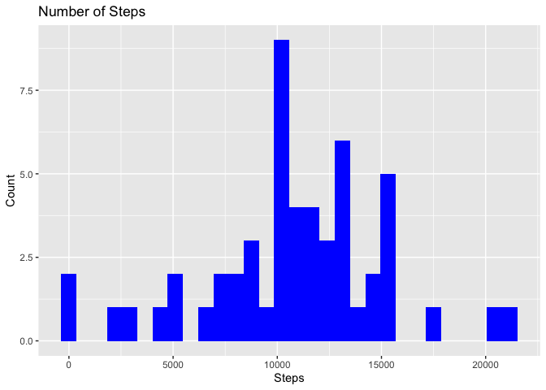
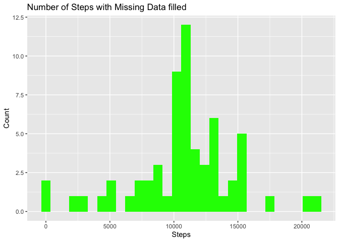
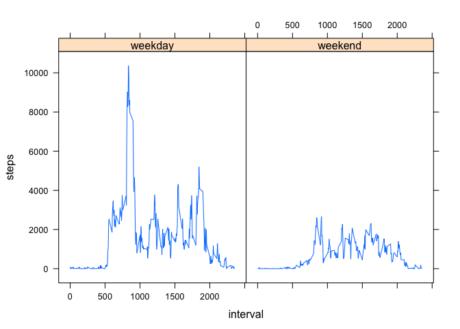

## Loading and preprocessing the data
### Packages
First, the packages required for this assessment are loaded

```r
library(ggplot2)
library(lubridate)
library(dplyr)
library(lattice)
```
### Unzipping and loading
The dataset is located in the zip file of the directory.

```r
unzip('./activity.zip')
dt <- read.csv('activity.csv')
```
### Preprocessing the data
Converting 

```r
dt$date <- ymd(dt$date)
```
## What is mean total number of steps taken per day?
Firstly, we need to remove the NA values found in the steps column from the 
table in order to do the required calculations. We put that into a new table
called dt_clean.

```r
dt_clean <- na.omit(dt)
```
Secondly, we need to aggregate the data by into a table, which is conveniently done using the aggregate() function. 

```r
dt_aggregate <- aggregate(steps ~ date, dt_clean, sum)
```

We then create the histogram. 

```r
plot <- ggplot(data = dt_aggregate, aes(steps)) + geom_histogram(fill="blue") +
    labs(title = "Number of Steps", x="Steps", y = "Count")
plot
```

```
## `stat_bin()` using `bins = 30`. Pick better value with `binwidth`.
```

<!-- -->


The mean of this dataset is __1.0766189\times 10^{4}__ and the median is __10765__.

## What is the average daily activity pattern?
Creating the aggregate table for the mean amount of steps per interval.

```r
time_series_aggregate <- aggregate(steps ~ interval, dt_clean, mean)
```
Now creating a time-series plot. 

```r
plot1 <- ggplot(data = time_series_aggregate, aes(x = interval, y = steps))
plot1 <- plot1 + geom_line()
plot1 
```

<!-- -->

## Imputing missing values
First, we need to determine how many missing values do we have.

```r
sum(is.na(dt$steps))
```

```
## [1] 2304
```
The approach to replacing the missing values would be proper if we were to replace the missing values with the mean values of that interval as that makes the data consistent. This is done using the for loop.

This for loop firstly checks for the missing value, then takes the interval value of the row with the missing 'steps' value, finds the according mean value for the inverval in the time_series_aggregate table, and then replaces it in the dt table. 


```r
for (i in 1:nrow(dt)) {
  if(is.na(dt[i,1]))
    {
      interval <- dt[i, 3]
      interval_row <- which(time_series_aggregate$interval == interval)
      mean_value <- time_series_aggregate[interval_row, 2]
      dt[i,1] <- mean_value
    }
}
```

The newly replaced values are then put into an aggregate table. 

```r
new_aggregate_table <- aggregate(steps ~ date, dt, sum)
```

Using this new table, we create a histogram. The X-axis has to be converted into an appropriate time axis.


```r
plot2 <- ggplot(data = new_aggregate_table, aes(steps)) + geom_histogram(fill = "green") + labs(title = "Number of Steps with Missing Data filled", x="Steps", y = "Count")
plot2
```

```
## `stat_bin()` using `bins = 30`. Pick better value with `binwidth`.
```

<!-- -->
The new mean of this dataset is ___1.0766189\times 10^{4}___ and the new median of this dataset is ___1.0766189\times 10^{4}___

## Are there differences in activity patterns between weekdays and weekends?
Firstly, we need to create a separate column in the table with all the corresponding weekdays. 

```r
dt <- mutate(dt, wd = weekdays(dt$date))
```
Then, we use the ifelse function to replace the weekdays into weekends/weekdays correspondingly.

```r
dt$wd <- ifelse(dt$wd %in% c("Saturday", "Sunday"), "weekend", "weekday")
```
We then aggregate the data into tables

```r
weekend_aggregate <- aggregate(steps ~ interval + wd, dt, sum)
```
And finally, using the lattice system, create two time-seried graphs.

```r
xyplot(steps ~ interval | wd, weekend_aggregate, type = c("l"))
```

<!-- -->
